# Application de gestion des rendez-vous médicaux

Cette application permet de gérer efficacement les **rendez-vous, consultations, patients et médecins** au sein d’un cabinet ou d’un établissement de santé.

## Objectif principal

Faciliter l’organisation des consultations médicales en automatisant la prise de rendez-vous, le suivi des patients et la gestion des activités des médecins.

---

## Structure des entités

### Médecin (`Medcin`)
- Attributs : `nom`, `prénom`, `spécialité`
- Relations :
  - Un médecin peut effectuer **plusieurs rendez-vous**
  - Chaque rendez-vous est associé à **un seul médecin**

### Patient
- Attributs : `nom`, `date de naissance`, `malade` (boolean)
- Relations :
  - Un patient peut avoir **plusieurs rendez-vous**
  - Chaque rendez-vous est lié à **un seul patient**

### Rendez-vous (`RandezVous`)
- Attributs : `date`, `status` (`PENDING`, `CANCELLED`, `DONE`)
- Relations :
  - Associé à **un patient** et **un médecin**
  - Peut être lié à **une seule consultation**

### Consultation
- Attributs : `date de consultation`, `rapport`
- Relations :
  - Liée à **un seul rendez-vous**

### Enumération `StatusRDV`
- `PENDING` – En attente
- `CANCELLED` – Annulé
- `DONE` – Effectué

---

## Cycle de vie d’un rendez-vous

1. Un **patient** prend un rendez-vous avec un **médecin**.
2. Le rendez-vous est créé avec le statut **PENDING**.
3. Une **consultation** est effectuée le jour du rendez-vous, et un **rapport** est ajouté.
4. Le statut du rendez-vous passe à **DONE** après la consultation.
5. Si le rendez-vous est annulé, le statut passe à **CANCELLED**.

---

## Avantages de l'application

- Centralisation des données patients et médecins.
- Suivi automatisé des consultations.
- Gestion des statuts des rendez-vous.
- Optimisation de l’emploi du temps médical.

---

## Technologies utilisées

- **Spring Boot**
- **JPA / Hibernate**
- **Base de données H2 **
- **Lombok**
- **Java 17+**


## Creation de application 
Nous avons créé le projet à l’aide de Spring Initializr, puis nous avons importé les dépendances nécessaires, notamment Spring Data JPA, H2 Database, Lombok et Spring Web pour gérer la persistance des données, la base de données en mémoire, la génération de code (getters/setters, constructeurs, etc.), et les couches web.
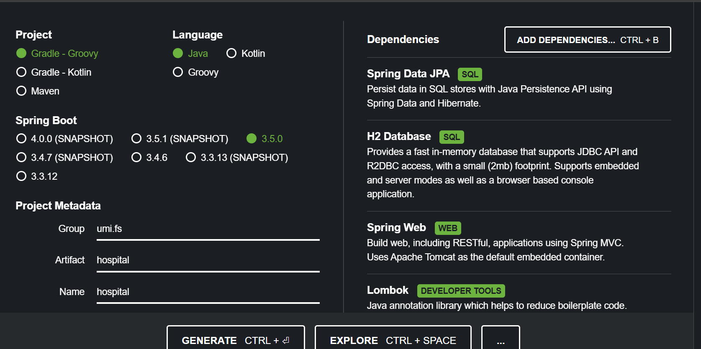

## Creation des entites 
Dans le cadre du développement de l’application, nous avons conçu les différentes entités du modèle métier (Patient, Médecin, RendezVous, Consultation) en utilisant les annotations JPA (Jakarta Persistence API) nécessaires afin d’assurer leur persistance en base de données.


Chaque entité a été annotée avec @Entity pour indiquer qu’il s’agit d’une classe persistante. L’identifiant primaire de chaque entité est défini à l’aide de l’annotation @Id, tandis que @GeneratedValue(strategy = GenerationType.IDENTITY) permet la génération automatique des identifiants par la base de données.

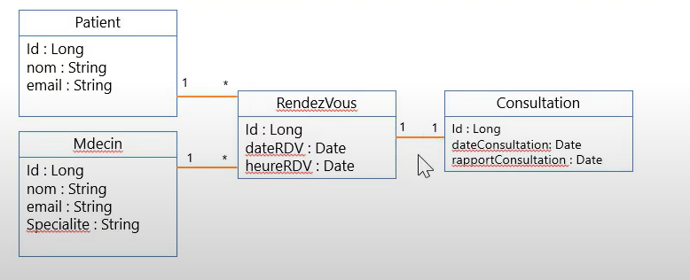

Les relations entre les entités sont modélisées à l’aide des annotations suivantes :

@OneToMany : utilisée pour représenter une relation un-à-plusieurs, par exemple entre un médecin et ses rendez-vous.
@ManyToOne : utilisée pour représenter une relation plusieurs-à-un, comme entre un rendez-vous et un patient ou un médecin.
@OneToOne : utilisée pour représenter une relation un-à-un, comme entre un rendez-vous et sa consultation.
@Temporal(TemporalType.DATE) : utilisée pour indiquer que les attributs de type Date doivent être enregistrés au format date (sans heure).

L’utilisation de ces annotations permet à l’ORM (Object Relational Mapping) de gérer automatiquement les correspondances entre les objets Java et les tables de la base de données, tout en respectant les contraintes d’intégrité relationnelle.
####Configurer l'unité de persistance dans le ficher application.properties 

Nous avons effectué les configurations nécessaires dans le fichier application.properties afin de définir les paramètres de l'application, notamment :
le nom de l'application,
l'activation de la console H2,
le port d'exécution (8080),
et l’URL de connexion à la base de données en mémoire.

Une fois la configuration terminée, nous avons exécuté l’application. Les entités définies ont ainsi été automatiquement converties en tables dans la base H2.
L’image suivante illustre les tables générées à partir des entités Java :
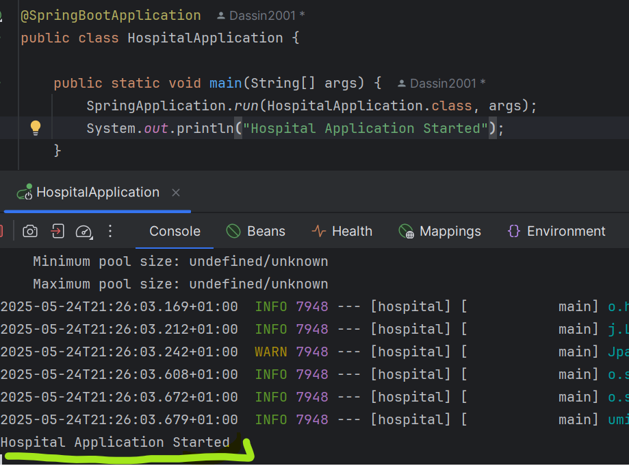

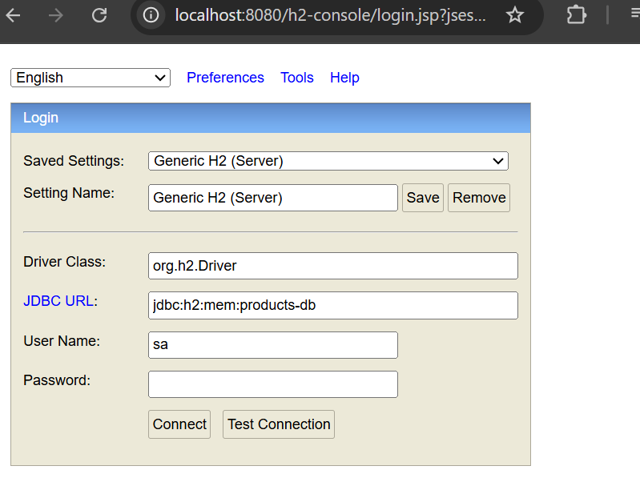

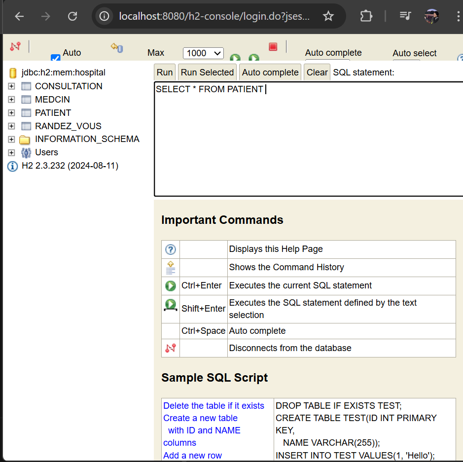


#### Créer l'interface JPA Repository basée sur Spring data
Nous avons créé une interface JPA Repository pour chaque entité (Patient, Médecin, RendezVous, Consultation) afin de faciliter les opérations de persistance.
Ces interfaces héritent de JpaRepository, ce qui permet de bénéficier automatiquement de méthodes prêtes à l’emploi pour effectuer les opérations CRUD (Create, Read, Update, Delete) sans avoir à écrire de requêtes SQL manuelles.

#### Tester quelques opérations de gestion de patients :
Pour tester le bon fonctionnement de notre application, nous avons créé une méthode qui retourne un objet de type CommandLineRunner.
Cette méthode permet d’exécuter automatiquement du code au démarrage de l’application Spring Boot. 
Afin d'exécuter automatiquement une méthode au démarrage de l'application, nous avons utilisé l'annotation @Bean. Cela permet à Spring de reconnaître la méthode comme un composant à instancier et à injecter dans le contexte d'exécution. Ainsi, au lancement de l'application, Spring appelle automatiquement cette méthode et exécute son contenu.

Dans notre cas, nous avons créé une méthode start() qui retourne un objet de type CommandLineRunner. Cette méthode est annotée avec @Bean, ce qui indique à Spring de l'exécuter au démarrage. Si nous souhaitons utiliser l'objet retourné ailleurs dans l'application, il suffit d’utiliser l’annotation @Autowired pour l’injecter automatiquement.

  ###### Ajouter des patients et medcins

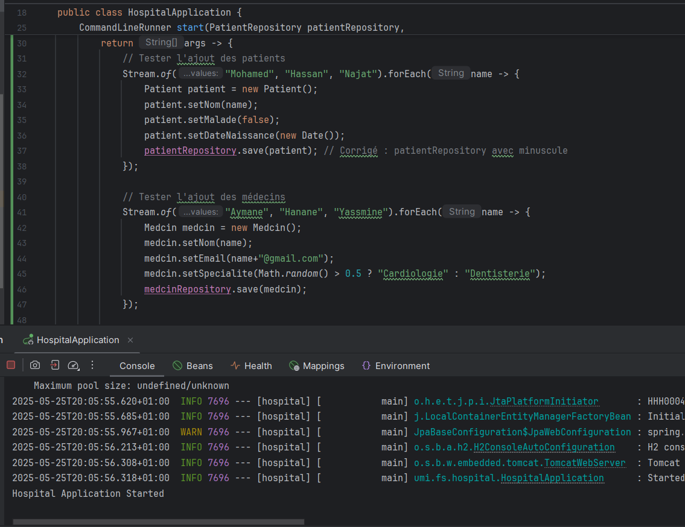

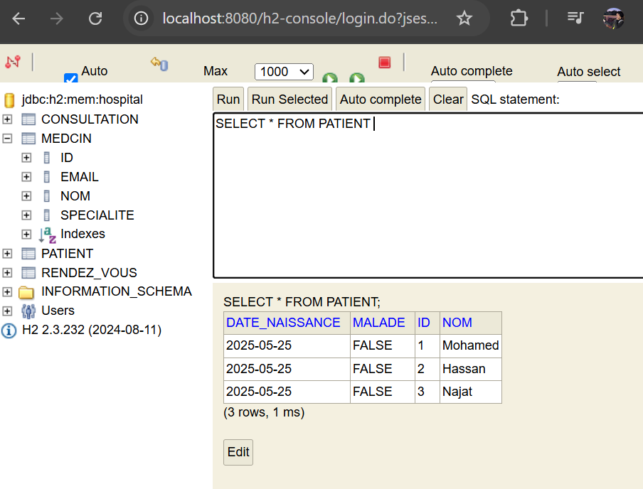       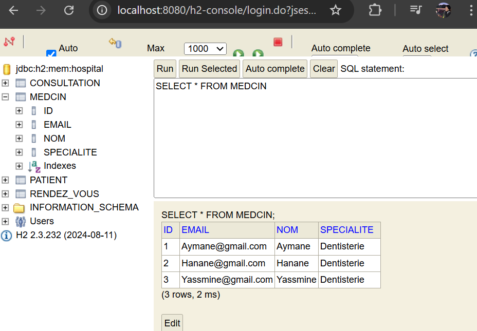


###### Consulter tous les patients et tous les medcins


```
// Consulter tous les patients
            System.out.println("onsulter tous les patients");
            List<Patient> patients = patientRepository.findAll();
            patients.forEach(p ->{
                System.out.println("Patient : "+ p.getId() + " ==> " +p.getNom());
            });
            
            // Consulter tous les Medcin
            System.out.println("Consulter tous les Medcins");
            List<Medcin> medcins = medcinRepository.findAll();
            medcins.forEach(m ->{
                System.out.println("Medcin : "+ m.getId() + " ==> " +m.getNom());
            });
```
### gestion de patient

Consulter un patient,Chercher des patients,Mettre à jour un patient,supprimer un patient
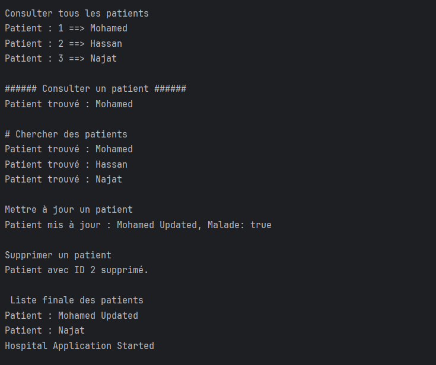 
### gestion de Medcin

Consulter un Medcin,Chercher des Medcins,Mettre à jour un Medcin,supprimer un Medcin
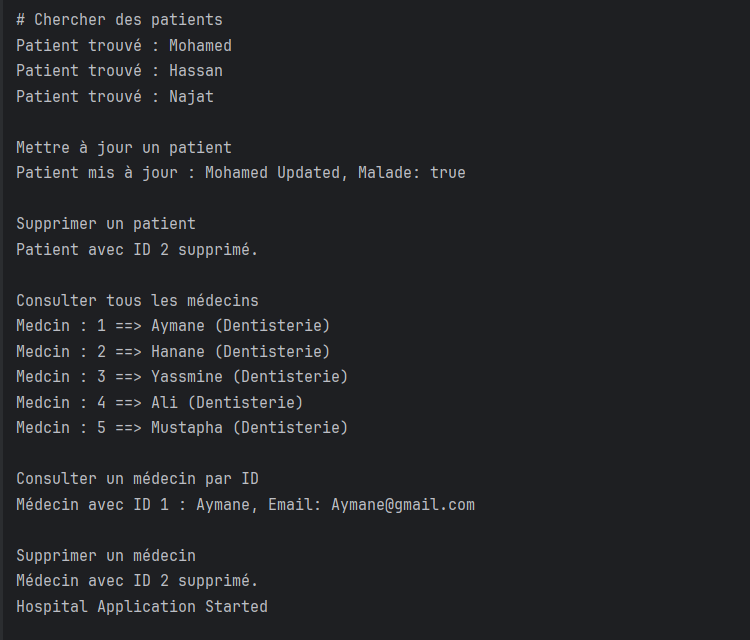 
### gestion de Consultation

Consulter un Consultation,Chercher des Consultations,Mettre à jour un Consultation,supprimer un Consultation
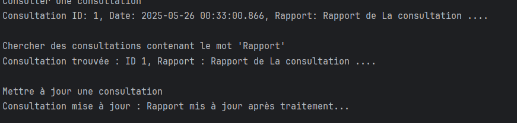 
### gestion de RendezVous
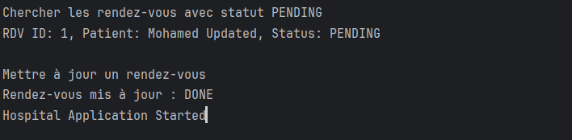 
Consulter un RendezVous,Chercher des RendezVouss,Mettre à jour un RendezVous,supprimer un RendezVous

#### Migrer de H2 Database vers MySQL
#### Conclusion 

